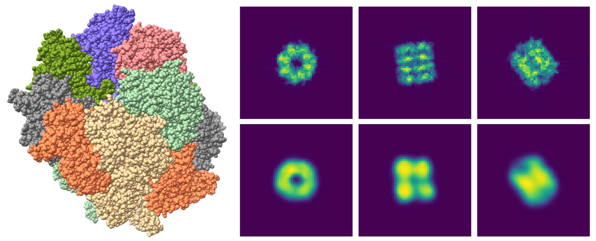
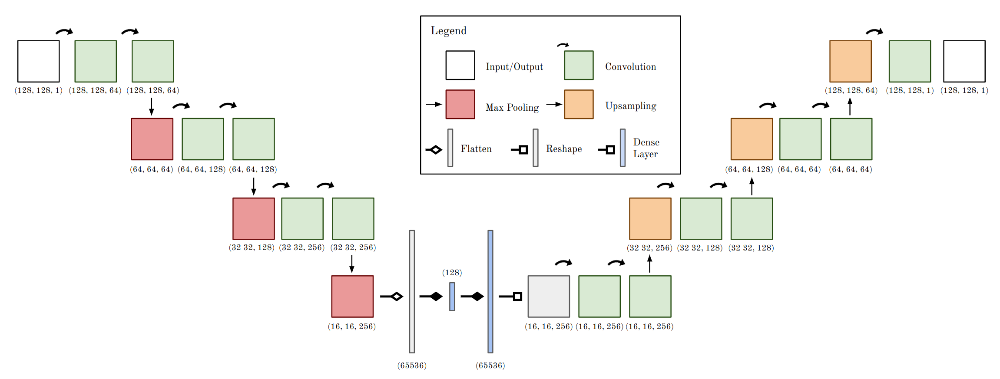

# Deep learning phase retrieval in X-ray single-particle imaging for biological macromolecules

_________________________________________________________________________________________________________________________________________
About this repository:

Companion repository to the paper Bellisario A., and Ekeberg T. "Deep learning phase retrieval in X-ray single-particle imaging for biological macromolecules", Machine Learning: Science and Technology (2024). 

This repository provides the code and the dataset used to train our convolutional neural network, which can provide low-resolution estimates on simulated coherent diffractive imaginge (CDI) data. Neural networks can potentially provide a much faster solution to phasing than traditional methods, serving as a support for further analysis. The model was trained on simulations from PDB files. 

__________________________________________________________

Data & Network weights:

The datasets are now deposited in the **Coherent X-ray Imaging Data Bank** (CXIDB) at https://cxidb.org/id-233.html and https://cxidb.org/id-232.html 
Weights can also be found at: https://shorturl.at/T1ztL

The scripts provided in the directory ~/scripts allow to download the PDB files from the .csv file ~/data/dataset.csv that compose our dataset. 
In ~/scripts you can also find scripts used for data generation using Condor and ChimeraX.

~/test folder provides a simple script to train and test the model

__________________________________________________________

Python packages recommendations:

Tensorflow 2.0.0 

Keras 2.3.1

Python package used in the paper for phase retrieval and PRTF: https://github.com/AlfredoBellisario/PyPhase
